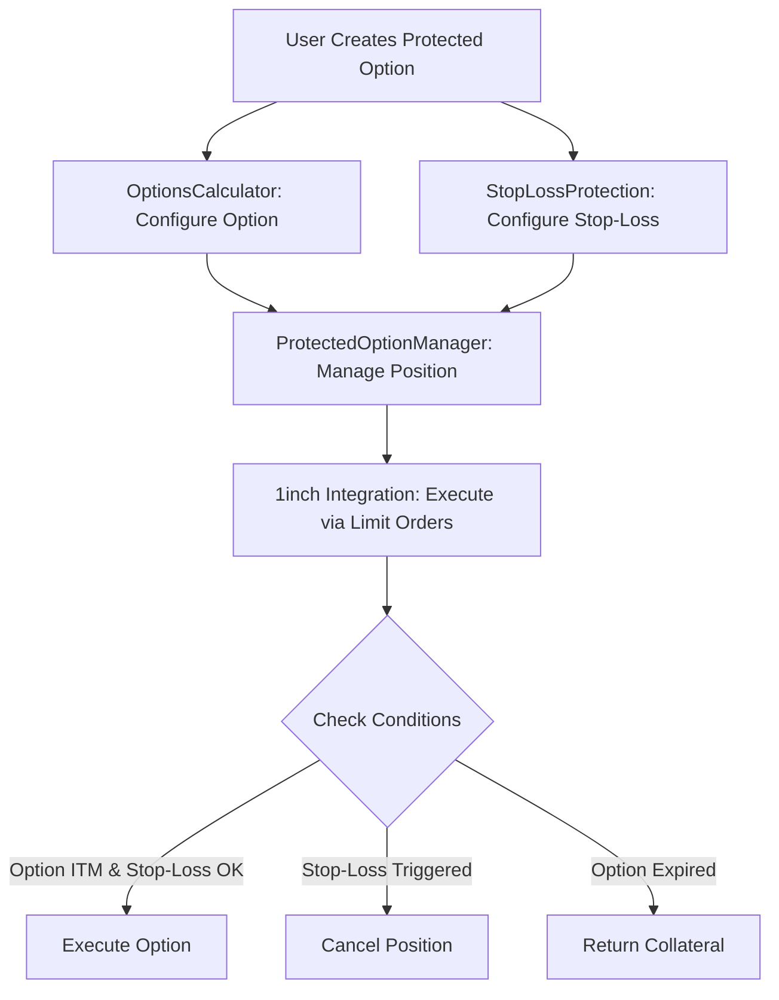

# 1inch Protected Options - Options-Like with Stop-Loss


A hybrid "protected option" system built on the 1inch Limit Order Protocol that creates option-like strategies with built-in stop-loss protection. This system mimics call/put payoffs while adding automated risk management through conditional predicates.

## 🎯 Overview

Traditional options strategies can be risky without proper risk management. This project creates **Protected Options** - a novel DeFi primitive that combines:

- **Option Payoffs**: Call and put option mechanics for price exposure
- **Stop-Loss Protection**: Automated exit triggers when markets move adversely  
- **1inch Integration**: Leverages the 1inch Limit Order Protocol for efficient execution
- **Risk Management**: Built-in safeguards to limit losses and protect capital

## 🏗️ Architecture

The system consists of four main components:

### Core Contracts

1. **`OptionsCalculator`** - Implements option payoff calculations
   - Call/put option logic with customizable strike prices
   - Intrinsic value calculations based on Chainlink oracles
   - Premium handling for out-of-the-money positions

2. **`StopLossProtection`** - Manages stop-loss predicates
   - Configurable stop-loss triggers based on price thresholds
   - Dynamic stop-loss calculation based on maximum loss percentages
   - Multi-condition logic for complex risk management

3. **`ProtectedOptionManager`** - Orchestrates the protected option lifecycle
   - Creates and manages protected option positions
   - Handles execution and cancellation logic
   - Integrates option calculations with stop-loss protection

4. **`OneinchProtectedOptionsIntegration`** - 1inch Limit Order Protocol integration
   - Implements `IAmountGetter` interface for custom amount calculations
   - Provides predicates for conditional order execution
   - Bridges protected options with 1inch's orderbook

### System Flow



## 🔧 Key Features

### Option Mechanics
- **Call Options**: Profit when asset price rises above strike price
- **Put Options**: Profit when asset price falls below strike price  
- **Customizable Parameters**: Strike price, premium, expiration, multiplier
- **Real-time Pricing**: Chainlink oracle integration for accurate pricing

### Stop-Loss Protection
- **Price-based Triggers**: Stop-loss when price hits threshold
- **Percentage-based Limits**: Maximum loss as percentage of position
- **Time Windows**: Configurable price validation periods
- **Multi-condition Logic**: Combine multiple stop-loss conditions

### 1inch Integration
- **Custom Amount Calculation**: Dynamic payoffs based on option values
- **Predicate Functions**: Conditional execution based on market conditions
- **Gas Efficiency**: Leverages 1inch's optimized order execution
- **Decentralized Execution**: Anyone can fill protected option orders

### Risk Management
- **Automated Exit**: Stop-loss triggers automatic position closure
- **Collateral Protection**: Maker assets held in escrow until execution
- **Expiration Handling**: Automatic position cleanup at expiration
- **Access Controls**: Secure authorization system for contract interactions

## 🚀 Quick Start

### Prerequisites

- Node.js v16+ 
- npm or yarn
- Git

### Installation

```bash
# Clone the repository
git clone https://github.com/your-org/1inch-protected-options
cd 1inch-protected-options

# Install dependencies
npm install

# Copy environment variables
cp .env.example .env
# Edit .env with your configuration
```

### Compile Contracts

```bash
npm run compile
```

### Run Tests

```bash
# Run all tests
npm test

# Run tests with coverage
npm run coverage

# Run tests with gas reporting
REPORT_GAS=true npm test
```

### Deploy Contracts

```bash
# Deploy to localhost
npm run deploy:localhost

# Deploy to mainnet (requires PRIVATE_KEY in .env)
npm run deploy:mainnet

# Deploy to Arbitrum
npm run deploy:arbitrum
```

## 📖 Usage Examples

### Creating a Protected Call Option

```solidity
// Example: ETH call option with stop-loss protection
await protectedOptionManager.createProtectedOption(
  true,                              // isCall = true
  ethers.parseUnits("2100", 8),     // strikePrice = $2100
  ethers.parseUnits("50", 18),      // premium = 50 tokens
  86400,                            // optionDuration = 1 day
  wethAddress,                      // makerAsset = WETH
  daiAddress,                       // takerAsset = DAI  
  ethers.parseUnits("1", 18),       // makingAmount = 1 WETH
  ethers.parseUnits("2000", 18),    // minTakingAmount = 2000 DAI
  ethers.parseUnits("1950", 8),     // stopLossPrice = $1950
  500,                              // maxLoss = 5% (500 basis points)
  ethUsdOracleAddress               // oracle = ETH/USD Chainlink feed
);
```

### Using 1inch Integration

```solidity
// Encode protected option data for 1inch order
bytes memory extraData = await integration.encodeProtectedOptionData(
  optionId,
  stopLossId,
  ethers.parseUnits("0.1", 18),    // minPayoff
  true                             // enforceStopLoss
);

// Use in 1inch limit order with custom predicate
bytes memory predicate = abi.encodeWithSelector(
  integration.protectedOptionPredicate.selector,
  extraData
);
```

### Checking Option Status

```solidity
// Get comprehensive option status
const [canExecute, currentPrice, intrinsicValue, stopLossStatus] = 
  await integration.getProtectedOptionStatus(optionId, stopLossId);

console.log(`Can Execute: ${canExecute}`);
console.log(`Current Price: $${ethers.formatUnits(currentPrice, 8)}`);
console.log(`Intrinsic Value: $${ethers.formatUnits(intrinsicValue, 8)}`);
console.log(`Stop-Loss Active: ${stopLossStatus}`);
```

## 🧪 Testing

The project includes comprehensive tests covering:

- **Unit Tests**: Individual contract functionality
- **Integration Tests**: Cross-contract interactions  
- **1inch Integration Tests**: Limit order protocol compatibility
- **Edge Case Tests**: Error handling and boundary conditions
- **Gas Optimization Tests**: Efficiency measurements

### Test Categories

- `OptionsCalculator`: Option payoff calculations and oracle integration
- `StopLossProtection`: Stop-loss trigger logic and predicates
- `ProtectedOptionManager`: Position lifecycle management  
- `OneinchProtectedOptionsIntegration`: 1inch protocol integration
- `Edge Cases`: Error handling, expired options, stale prices

## 📋 Contract Addresses

### Mainnet
```
OptionsCalculator: 0x...
StopLossProtection: 0x...
ProtectedOptionManager: 0x...
OneinchProtectedOptionsIntegration: 0x...
```

### Arbitrum
```
OptionsCalculator: 0x...
StopLossProtection: 0x...
ProtectedOptionManager: 0x...
OneinchProtectedOptionsIntegration: 0x...
```

*Note: Replace with actual deployed addresses*

## 🔒 Security Considerations

### Audits
- [ ] Internal security review completed
- [ ] External audit pending
- [ ] Bug bounty program planned

### Known Limitations
- Relies on Chainlink oracle availability and accuracy
- Stop-loss execution depends on network conditions
- MEV considerations for option executions
- Smart contract risk inherent to DeFi protocols

### Best Practices
- Always test with small amounts first
- Monitor oracle price feeds for accuracy
- Consider gas costs in profit calculations
- Use appropriate slippage tolerances

## 🛠️ Development

### Project Structure

```
├── contracts/
│   ├── OptionsCalculator.sol           # Option payoff calculations
│   ├── StopLossProtection.sol         # Stop-loss predicates
│   ├── ProtectedOptionManager.sol     # Main orchestration contract
│   ├── OneinchProtectedOptionsIntegration.sol  # 1inch integration
│   └── mocks/                         # Test contracts
├── test/
│   └── ProtectedOptionsTest.js        # Comprehensive test suite
├── scripts/
│   └── deploy.js                      # Deployment script
├── deployments/                       # Deployment artifacts
└── docs/                             # Additional documentation
```

### Contributing

1. Fork the repository
2. Create a feature branch (`git checkout -b feature/amazing-feature`)
3. Commit your changes (`git commit -m 'Add amazing feature'`)
4. Push to the branch (`git push origin feature/amazing-feature`)
5. Open a Pull Request

### Code Style

- Follow Solidity style guide
- Use explicit function visibility
- Include comprehensive NatSpec documentation
- Write descriptive variable names
- Add unit tests for new functionality

## 📊 Gas Optimization

The contracts are optimized for gas efficiency:

- **Packed Structs**: Efficient storage layout
- **Immutable Variables**: Reduced storage reads  
- **Custom Errors**: Lower gas than require strings
- **Batch Operations**: Multiple actions in single transaction
- **View Functions**: Off-chain calculations where possible

## 🤝 1inch Limit Order Protocol Integration

This project leverages the 1inch Limit Order Protocol's advanced features:

### IAmountGetter Implementation
- Custom amount calculations based on option payoffs
- Dynamic pricing based on current market conditions
- Integration with intrinsic value calculations

### Predicate Functions
- Conditional execution based on stop-loss triggers
- Multi-condition logic for complex strategies
- Real-time market condition checking

### Gas Efficiency
- Utilizes 1inch's gas-optimized execution
- Minimal overhead for option calculations
- Efficient predicate evaluation

## 🔮 Future Enhancements

### Planned Features
- [ ] Advanced option strategies (spreads, straddles)
- [ ] Multi-asset collateral support
- [ ] Yield farming integration
- [ ] Options portfolio management UI
- [ ] Advanced analytics and reporting

### Research Areas
- [ ] Automated market maker for option pricing
- [ ] Cross-chain option execution
- [ ] Options on synthetic assets
- [ ] Decentralized option pricing models

## 📚 Additional Resources

- [1inch Limit Order Protocol Documentation](https://docs.1inch.io/docs/limit-order-protocol/)
- [Chainlink Price Feeds](https://docs.chain.link/data-feeds/price-feeds)
- [Options Trading Basics](https://www.investopedia.com/options-basics-tutorial-4583012)
- [DeFi Risk Management](https://defipulse.com/blog/defi-risk-management)

## 📄 License

This project is licensed under the MIT License - see the [LICENSE](LICENSE) file for details.

## ⚠️ Disclaimer

This software is provided "as is", without warranty of any kind. Users are responsible for understanding the risks associated with options trading and DeFi protocols. Always conduct thorough testing and consider professional advice before using in production.

---

**Built with ❤️ for the 1inch Hackathon**

*Creating safer DeFi strategies through innovative risk management* 